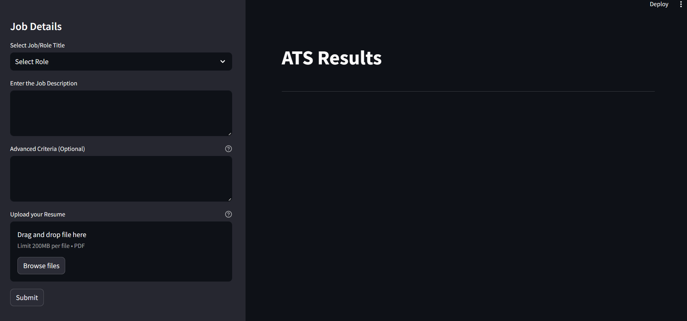
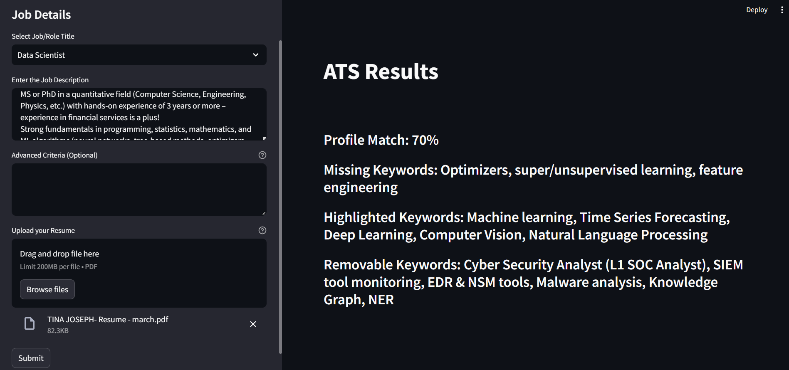

## Application Tracking System (ATS) using Generative AI

This project is designed to automate the job application processing and matching process using Streamlit, Google's generative AI API, and PyPDF2. It involves an Application Tracking System (ATS) designed to help job seekers optimize their resumes for specific job roles and help recruiters streamline their recruitment process.

The main features of this project include:

- A Streamlit app that enables users to upload their resumes in PDF format, select a job title, enter a job description, and specify advanced criteria for matching. The app then provides automated feedback on the profile match percentage, missing keywords, highlighted keywords, removable keywords, and experience relevance.
- Integration with Google's generative AI API (Gemini) to generate content based on input prompts and provide insights for job application optimization.
- Customized prompts for different job roles are stored in the '/prompts/' folder, allowing for tailored feedback based on the selected role in the dropdown menu.
- PyPDF2 is used for PDF processing, and the app integrates with the Google GenAI API for keyword matching. The app displays profile match percentages and other details, which helps candidates optimize their resumes and recruiters streamline their recruitment process.

Overall, this project leverages cutting-edge technology to automate and optimize the job application process, making it easier for job seekers and recruiters.

